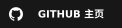

  <h1>Hi there 👋</h1>
  
Welcome to my GitHub profile

<table width="100%" border="0" cellspacing="14" cellpadding="0">
  <tr>
    <td width="58%" align="center" valign="middle" style="border:1px solid #d0d7de; border-radius:22px; padding:20px;">
      
    </td>
    <td width="42%" align="center" valign="middle" style="border:1px solid #d0d7de; border-radius:22px; padding:20px;">
      

        CONNECT
      

      

      OPEN CHANNELS
       
      <a href="https://github.com/R1d3rZzz">
        <picture>
          <source media="(prefers-color-scheme: dark)" srcset="./assets/github-home-dark.svg" />
          
        </picture>
      </a>
       
       
      <a href="https://gitee.com/r1d3rzzz">
        <picture>
          <source media="(prefers-color-scheme: dark)" srcset="./assets/gitee-home-dark.svg" />
          
        </picture>
      </a>
       
       
      <a href="https://github.com/R1d3rZzz/404">
        <picture>
          <source media="(prefers-color-scheme: dark)" srcset="./assets/blog-disabled-dark.svg" />
          
        </picture>
      </a>
       
       
      

      
●&nbsp;STATUS&nbsp;·&nbsp;ONLINE

    </td>
  </tr>
</table>

 

  —&nbsp;Building quietly. Learning continuously.&nbsp;—

